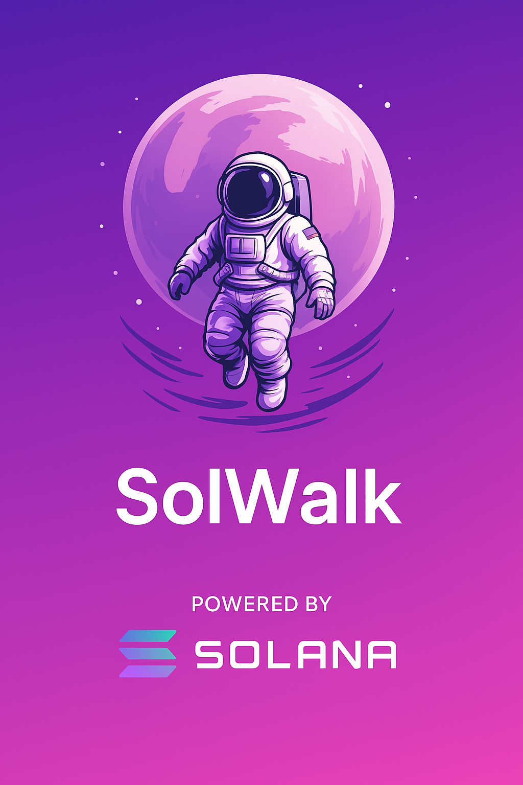

# 🏆 SOLWALK - Decentralized Fitness  App (Solana) 🏃‍♂️💨


## 🌟 Introduction
StepBet revolutionizes fitness motivation by combining blockchain technology with health tracking. Users bet on their daily step counts, compete with friends, and earn crypto rewards for meeting targets - all while improving their health!

## 🔍 Core Features

### 1. Competition Creation
- Set entry fees, duration, and step targets
- Define maximum participants
- Choose competition type (Solo/Duels/Tournaments)

### 2. Participant Flow
1. Connect Google Fit/Health Connect
2. Pay entry fee via Solana wallet
3. Track daily progress
4. Meet targets to avoid strikes
5. Win proportional rewards

### 3. Technical Integration
- Automated step tracking every 15 minutes
- Blockchain-based reward distribution
- Secure health data verification
- Smart contract enforcement

## 🛠️ Architecture

### Blockchain Components
- StepBet.sol: Main contract
- TokenVault.sol: Prize management
- Verification.sol: Data validation

### Safety Features
- Money-back guarantee
- Anti-spoofing measures
- Multi-step verification
- Automatic refund system

## 🚀 Getting Started

### Prerequisites
- Node.js 18+
- Solana CLI
- PostgreSQL
- Google Fit API credentials

### Installation
```bash
git clone https://github.com/your-repo/stepbet-backend.git
cd stepbet-backend
npm install
cp .env.example .env
npm run dev
```

## 📜 License
MIT Licensed - See LICENSE for details.
